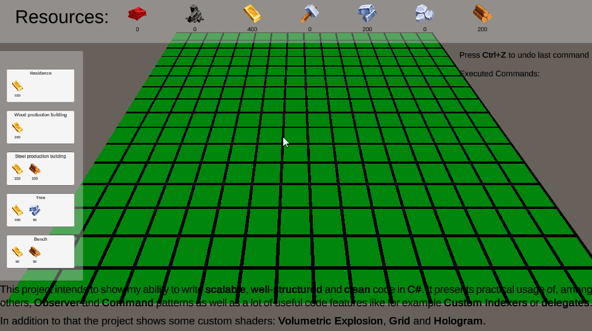

# CityBuilder
Small sim city game (super simplified)

This project intends to show my ability to write <b>scalable</b>, <b>well-structured</b> and <b>clean</b> code in <b>C#</b>. It presents practical usage of, among others, <b>Observer</b> and <b>Command</b> patterns as well as a lot of useful code features like for example <b>custom indexers</b> or <b>delegates</b>.
In addition to that the project shows some custom shaders: <b>Volumetric Explosion</b>, <b>Grid</b> and <b>Hologram</b>.

Project is still under construction.

